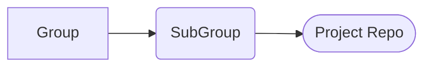

# SalesAmerSP_GitPolicy

## Git Procedures

### Trunk-based development
The recommended workflow for implementing GitOps with Kubernetes manifests is known as trunk-based development. This method defines one branch as the "trunk" and carries out development on each environment in a different short-lived branch. When development is complete for that environment, the developer creates a pull request for the branch to the trunk. Developers can also create a fork to work on an environment, and then create a branch to merge the fork into the trunk.

Once the proper approvals are done, the pull request (or the branch from the fork) gets merged into the trunk. The branch for that feature is deleted, keeping your branches to a minimum. Trunk-based development trades branches for directories.

You can think of the trunk as a "main" or primary branch. production and prod are popular names for the trunk branch.

Trunk-based development came about to enable continuous integration and continuous delivery by supplying a development model focused on the fast delivery of changes to applications. But this model also works for GitOps repositories because it keeps things simple and more in tune with how Kustomize and Helm work. When you record deltas between environments, you can clearly see what changes will be merged into the trunk. You won’t have to cherry-pick nearly as often, and you’ll have the confidence that what is in your Git repository is what is actually going into your environment. This is what you want in a GitOps workflow.

### Protected Branch
All *main* branches will be set as protected branches. This will only allow maintainer level users to merge commits into that branch. This way, users can push to lower branches and use the Pull Request (PR) process to have the owner merge updates into main. [Protected Branch](https://docs.gitlab.com/ee/user/project/protected_branches.html](https://docs.github.com/en/repositories/configuring-branches-and-merges-in-your-repository/managing-protected-branches/about-protected-branches)


### Other Published Guidance
Our Open Source Project Office (OSPO) on preparing your code can be found [here](https://ospo.pages.gitswarm.f5net.com/ospo-documentation/docs/publishing/#preparing-your-code)

The Open Source Security Foundation published guidance can be found [here](https://github.com/ossf/wg-security-tooling/blob/main/guide.md).

### Security Scanning
It may become helpful to use other security tools to scan your project for certificates, keys, and tokens. Github and Gitlab have some of these features built in but also require the user to understand and construct *ci* files. They also do **NOT** fail a build when a *secret* is found. You can run these security tools against you repository to verify you do not have any issues.

- [gitleaks](https://github.com/zricethezav/gitleaks)
- [trufflehog](https://github.com/trufflesecurity/trufflehog)


### Other Environments
I have added this section to describe how the SP will proceed on standing up other environments(i.e. Private Repository, Vendor specific testing based on a existing SP Repository). Most of these situations would require a *fork* of the original project. Meaning this new *fork* is a separate project being worked independently. 

- clone - I will contribute back into the same project repository
- fork - I will make my own project repository in my own namespace and work on independent demo

##

## Creating a New Project

<div class="center">


</div>

The SalesAmerSP Git structure is made from Group->Project view.

**PLEASE REMEMBER TO CREATE:**

- README.md (checkbox at creation time)
- .gitignore 
- dev branch 

#### README.md 
Please use the **README.md** file to explain your repository and any special callouts that need to be addressed. Remember that this may be the only interaction a user has with your repository so the greater the explanation the better.

[Gitlab Markdown Guide]([https://about.gitlab.com/handbook/markdown-guide/](https://docs.github.com/en/get-started/writing-on-github/getting-started-with-writing-and-formatting-on-github/basic-writing-and-formatting-syntax))    
[Mermaid Guide]([https://about.gitlab.com/handbook/tools-and-tips/mermaid/](https://github.com/mermaid-js/mermaid))  

#### .gitignore
A `.gitignore` is an invaluable file to have in your repository. The file explicitly tells Git what files should not be tracked. Each line in this file
specifies a file or pattern to be matched. For files like certificates, keys or other file types (i.e. pycache .DS_Store) gitignore will make sure those files do not become part of our public repository. Each repository should have a `.gitignore`

A gitignore file generator: [gitignore.io](www.toptal.com/developers/gitingore)


#### Branches 
With branches, we can introduce (or reject) new changes into our production branch. We can only have one branch checked out at a time. The currently checked out branch is also referred to as the HEAD branch.

A NetOps example of this would be to clone the repository housing the running router configs. A feature branch could be created to test and develop an improved BGP process. Once designed and tested, this new BGP process can be merged into the production branch. And since this is all in Git, we have the necessary documentation:

- Who did this?
- What problem did it solve (commit message)
- When did this happen?
- Who approved it?

Branches are not to be used for different environments or projects. For different environments (prod and pre-prod) the best practice is to create separate directories within the repository. For different projects please see [Other Environments](#other-environments)


##
## Working with an Existing Project 

Clone the `dev` repo to your machine. You can clone using the cli command:

`git clone git@gitswarm.f5net.com:<group name>/<sub-group>/<repository> --branch <branch name>`

Example: `git clone git@gitswarm.f5net.com:cnf-cop-grp/ocp/ocp_4.8.git --branch dev`

To access the clone url you can visit the project page like the example below: 


Validate your clone by cd to the cloned folder and verify:

```
C.Wise@GJ4HFVQPGW ocp_4.8 % git branch
* dev
C.Wise@GJ4HFVQPGW ocp_4.8 %
```
Now, create your own branch, first letter of first name and last name *-* what your branch is to fix:

```
C.Wise@GJ4HFVQPGW ocp_4.8 % git checkout -b cwise-fixSriov
Switched to a new branch 'cwise-fixSriov'
C.Wise@GJ4HFVQPGW ocp_4.8 % git branch
* cwise-fixSriov
  dev
C.Wise@GJ4HFVQPGW ocp_4.8 %
```
Publish your new branch   
From VSCode, please include the "what your branch is to fix" in your commit


From cli 
```
git push -u origin cwise-fixSriov`
```

Please complete your work within your newly created branch.

## Merge Requests


Merge your newly created branch into the `dev` branch


Make certain you have **Delete source branch when merge request is accepted.** checked


